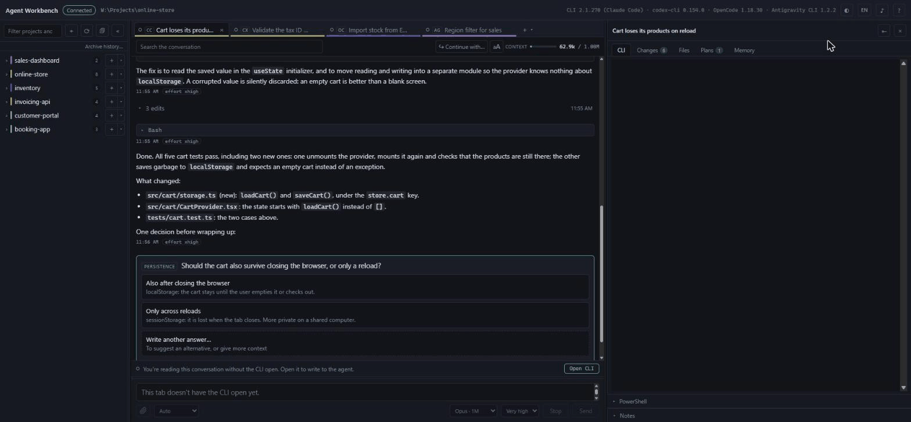
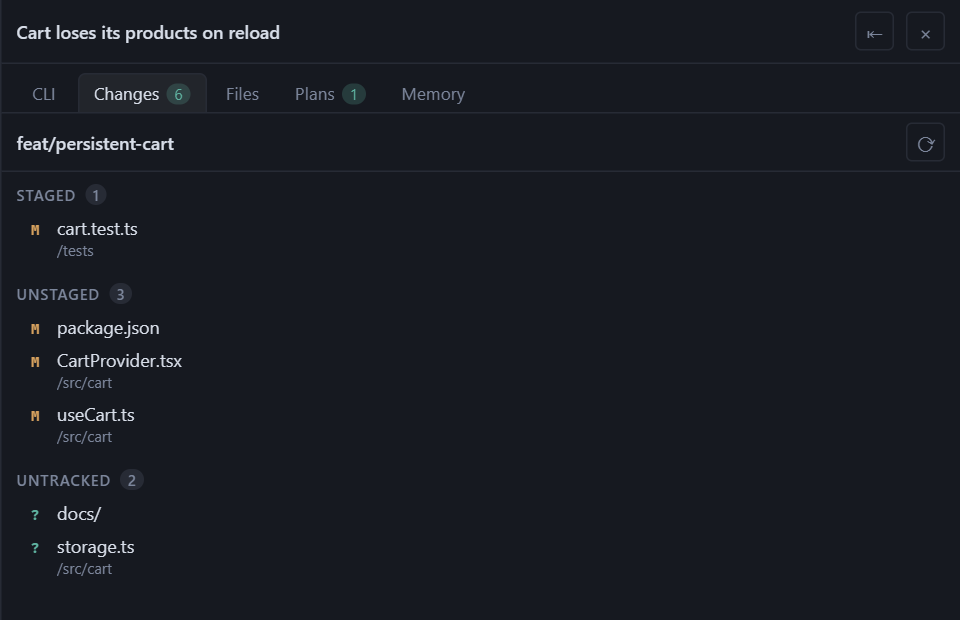
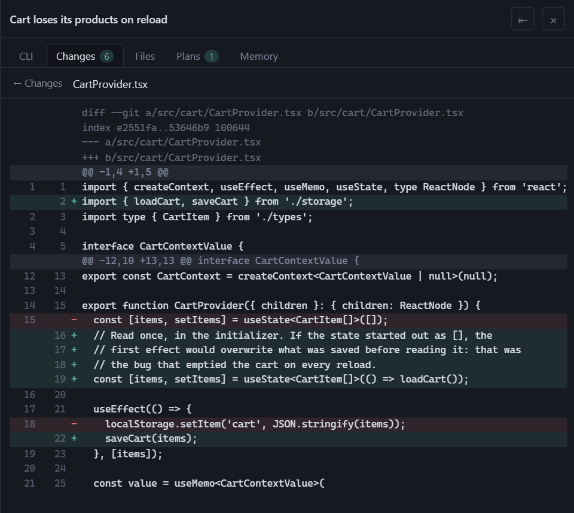
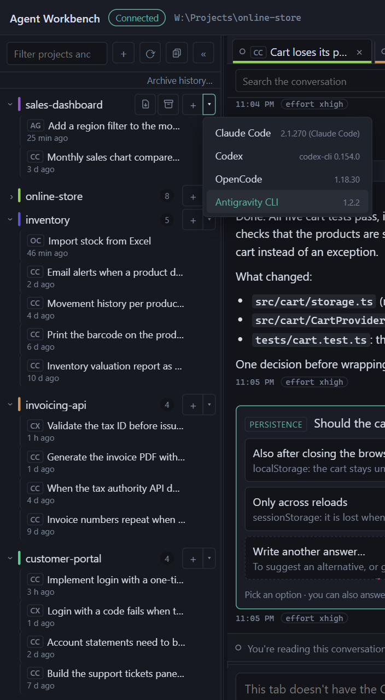
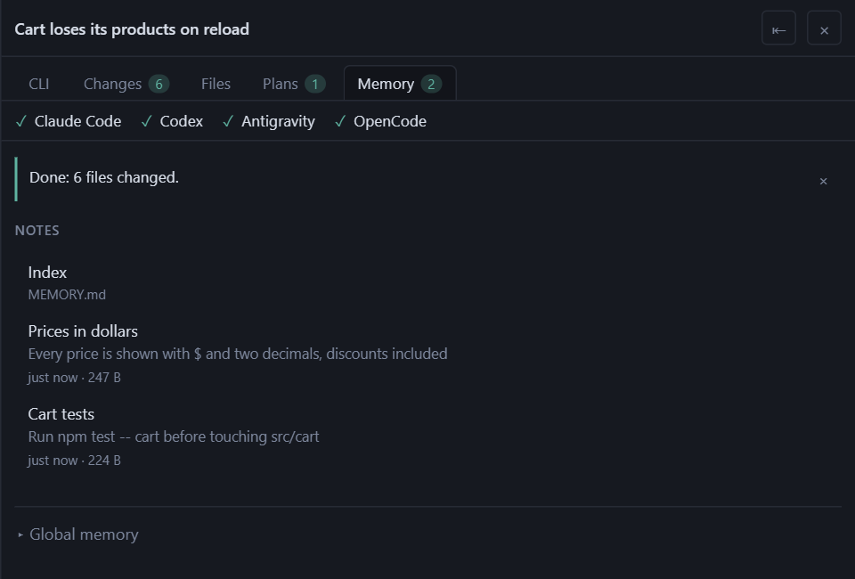
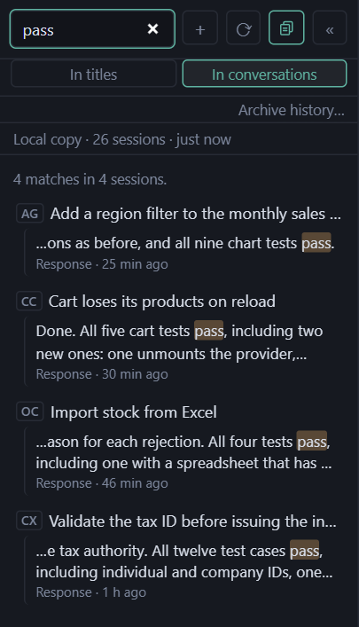
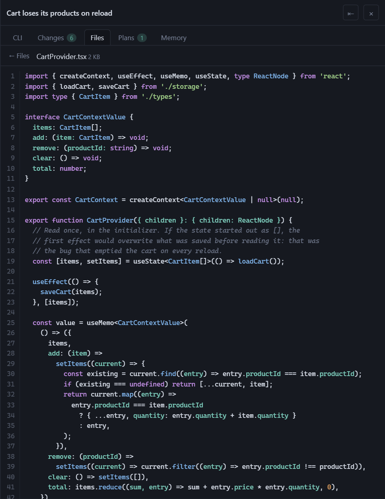

# Agent Workbench

[](https://www.npmjs.com/package/agent-workbench)
[](https://github.com/cvelasquez/agent-workbench/actions/workflows/ci.yml)
[](LICENSE)

**One local interface for the Claude Code, Codex, OpenCode and Antigravity
CLIs.** It uses the CLIs you already have logged in, never touches your
credentials, and makes no network calls of its own.

```bash
npx agent-workbench
```



It doesn't talk to any API. It launches the CLI you already have installed and
logged in —`claude`, `codex`, `opencode` or `agy`— inside a pseudo-terminal, and
adds around it what a terminal alone doesn't give you: tabs, browsable history,
the conversation as cards, a context meter, git status and a file tree.

The terminal is still the terminal. Everything you type reaches the CLI without
the app touching it.

---

## What it does

| | |
|---|---|
| **Tabs** | Several live sessions at once, from any of the CLIs, each in its own directory. They survive an `F5`: the processes live on the server, not in the browser tab. Each tab's dot tells you whether the agent is working, idle or waiting for an answer, on the CLIs that publish their status ([below](#multiple-clis)). |
| **Zero-cost startup** | When you open the app, tabs come back as **sleeping tabs**: you can read them in full, and they don't launch any CLI. You open the CLI with a button when you want to write to the agent. |
| **History** | Your projects and past conversations in the sidebar, with a filter, and those of all four CLIs together under each project, each with its badge. Opening one resumes it with its CLI, in the same session. **Archive history…** hides a CLI's sessions from before today in one go, and each project can be archived whole with one button: nothing is deleted, and both can be undone. |
| **Conversation** | The active session's messages, live, with tool calls collapsed and their results inside. Search, jump between matches, copy any message and, depending on the CLI, answer the agent's questions from the chat. |
| **Continue with…** | With more than one CLI installed, a conversation can be continued with another CLI in the same folder. The new agent starts from a transcript of the last turns, not from the context the previous one had. |
| **Search everything** | With more than one CLI and something saved in the local copy, the sidebar filter also searches the text of every saved conversation, not just their titles. |
| **Context meter** | Tokens from the last request against the model's context window. Tokens, never money. |
| **Changes** | Branch, ahead and behind against the upstream branch, worktrees, and the changed files with their diff. **Read-only.** |
| **Files** | The tree of the tab's directory, with search by name and a preview with syntax highlighting. A context menu to copy paths, insert them as `@path` or open the file with the system's default app. |
| **Plans** | The documents written by that conversation, rendered: the plans from plan mode, and also the `.md` files the agent created inside the project or in the session's temp folder. Only those named by the conversation you're viewing. |
| **Shared memory** | What agents learn about a project, in `.agents/memory/`, read and written by all four CLIs ([below](#shared-memory)). |
| **Local copy** | Optional. The history of all four CLIs in a folder of yours, in the app's own format, so you don't lose it if a CLI changes its format, deletes it, or you uninstall the CLI ([below](#local-copy-optional)). |
| **Nine languages** | The interface in English, Español, 简体中文, 日本語, Português (Brasil), Русский, 한국어, Français and Deutsch. It follows the browser's language and can be changed from the header, without reloading. |
| **Theme** | Light, dark, or the system's. |

<p>
  
  
</p>

### Multiple CLIs

With more than one CLI installed, every session in the sidebar and every tab
carries its CLI's badge, and the new-tab `+` opens with the one you used in that
project; its arrow lets you pick another. With just one, you see none of this.



**Not every CLI exposes the same things.** Claude Code leaves everything the app
needs in its files. Codex leaves the history and the meter's tokens, but not its
status, its pending permissions, its questions or the model: its dot says the
status is unknown, there's no "waiting" notice and questions are answered in its
terminal. With OpenCode, the app starts a local OpenCode server when you open a
tab, and that's where its status, the notice that it's waiting for a permission
and the questions you answer from the chat come from. Antigravity CLI publishes
its status and tokens only if you configure its status line
([below](#antigravity-cli-status-and-meter-optional)).

---

## Requirements

| | |
|---|---|
| **Node.js** | 20 or later. **To see the OpenCode history and the Antigravity CLI titles, 22.13 or later**: they're read with the SQLite that Node ships since that version. With an older one everything else works the same; the startup output warns about OpenCode, and Antigravity CLI lists its conversations without the titles or folders from its index |
| **git** | for the Changes panel; everything else works without it |
| **At least one CLI** | installed and logged in (table below) |

| CLI | Command | Installation |
|---|---|---|
| Claude Code | `claude` | [installation guide](https://docs.claude.com/en/docs/claude-code/setup) |
| Codex | `codex` | [guide](https://learn.chatgpt.com/docs/codex/cli) |
| OpenCode | `opencode` | [documentation](https://opencode.ai/docs/) |
| Antigravity CLI | `agy` | [guide](https://antigravity.google/docs/cli/getting-started). For its status and meter, also `node` in the CLI's `PATH` |

Agent Workbench does **not** bundle or download any CLI: it uses the ones you
already have in your `PATH`. If it doesn't find any, it tells you so and doesn't
open sessions.

Tested on Windows 11 with PowerShell, which is the main platform. macOS and
Linux work the same. On Linux, the `node-pty` dependency doesn't ship a prebuilt
binary and is compiled on install: you need `python3`, `make` and a C++ compiler
(`build-essential` on Debian and Ubuntu).

---

## Install

```bash
npm install -g agent-workbench
```

Then, from the folder of the project you want to work on:

```bash
agent-workbench
```

To try it once without installing it, `npx agent-workbench` — it downloads about
60 MB whenever the npm cache is cold, mostly the terminal's native binary. For
daily use, the global install is the better choice.

The server prints a URL with a token and opens it in the browser:

```
  URL          http://127.0.0.1:52341/?token=…
```

That URL is the only way in. The token is different on every start, and the
server listens only on `127.0.0.1`.

### Shared memory

Each CLI keeps what it learns about a project in its own folder, and the others
can't see it. The **Memory** tab installs a bridge so all four use the same one:
notes in the project's `.agents/memory/`, which each CLI reads and writes —from
here or from its own terminal— through `AGENTS.md` and `CLAUDE.md`.

**Preview changes** shows, file by file, what will be written, and nothing is
touched until you confirm. Installing imports the memory Claude Code already had
for that project. The app doesn't write each CLI's global memory: it gives you
the snippet to paste yourself.



### Antigravity CLI: status and meter (optional)

Antigravity CLI doesn't record in any file whether it's working, waiting for you
to authorize a tool or idle, nor how many tokens it has used: it only publishes
that through its *status line*. Without it configured, its tabs work the same
—history, conversation, mode, model— but the tab's dot says the status is
unknown and the meter stays empty. To turn it on:

1. Open an Antigravity tab and click **Configure**, next to the meter.
2. Copy the line the dialog shows and merge it into whatever
   `~/.gemini/antigravity-cli/settings.json` already has. The app doesn't touch
   that file: you edit it.
3. The dialog switches to **Configured** on its own within a couple of seconds,
   or with **Check**.

The line runs a script the app keeps in its own folder. It saves only each
conversation's status, mode, model and tokens, in that same folder; it doesn't
save your email, quota, plan or cost, which the CLI also passes to it, and it
prints nothing, so the CLI's own status line stays as it is. Once set, **every**
`agy` session runs it, including those you open outside the app, and it needs
`node` in the `PATH`. On Windows the line changes into the script's folder
instead of naming the script in quotes: the CLI runs it with `cmd /c`, and no
quote reaches `node` intact.

### Local copy (optional)

Each conversation's history belongs to its CLI, in its format, and a CLI can
change it, prune it or cease to exist. The local copy keeps the same as that
history —messages, tool inputs and results, images and each project's memory—
in a folder of yours, in files you can read without the app. **It's off by
default.** The local copy button, in the header of the projects sidebar, opens a
dialog: first **Measure** tells you how much space it would take per CLI,
without writing anything, and then **Turn on** enables it. Once on, it copies
everything the sidebar lists that isn't archived, and copies each session that
changes again a minute after it goes quiet. Archived sessions aren't copied, and
archiving doesn't delete what was already copied: the app never deletes anything
from that folder.

Whatever the CLI no longer has stays in the sidebar, marked as a copy, and opens
in Markdown; each project can be exported to Markdown. And with the copy on and
more than one CLI, the sidebar filter offers **In conversations**: it searches
the text of everything copied, from every CLI.



By default it lives inside the app's configuration folder
(`%APPDATA%\agent-workbench\vault` on Windows). **Change folder…** copies all of
it to another one —a synced folder, another drive— without overwriting anything,
and the previous one stays as it was. If you put it in a synced folder or in a
repository, what it keeps travels with it.

Two one-off importers bring in history from tools the app doesn't read. They run
from source ([below](#from-source)) and **write nothing without `--write`**:
without it, they tell you what they would import.

- `pnpm vault:import gemini-cli [--cwd <folder>]` — the chats left over from
  Gemini CLI; `--cwd` names the folder where you used it, to place them in their
  project.
- `pnpm vault:import antigravity-ide --workspace <folder>` — whatever is
  readable from the Antigravity IDE conversations in that folder: each one's
  summary and its `.md` documents. The conversation content is encrypted, so it
  is marked as partial history.

---

## From source

To work on the app, or if you'd rather not install anything globally:

```bash
corepack enable pnpm
pnpm install
pnpm dev       # Vite with hot reload
```

```bash
pnpm build     # builds the interface once
pnpm start     # serves the built interface, without Vite
```

### One-click start on Windows

```bash
pnpm package
```

It builds the interface and leaves an **`Agent Workbench.cmd`** in the root.
Double-click it and you're done: it installs whatever is missing, builds if
needed and opens the browser. It's a twenty-line text file; you can read all of
it before running it.

---

## Keyboard shortcuts

`Alt+T` new tab · `Alt+W` close · `Alt+←/→` (or `Alt+PgUp/PgDn`) switch tabs ·
`Alt+P` show or hide the right panel · `Shift+Tab`, outside the terminal, go
back to the previous tab.

The `?` button in the top bar lists them all, along with the shortcuts of the
tab's CLI.

**Why `Alt` and not `Ctrl`:** the browser keeps `Ctrl+T`, `Ctrl+W` and
`Ctrl+Tab` for its own tabs and the event never reaches the page. It's not
something `preventDefault` can fix: there's no event to prevent.

The app captures exactly those combinations and no others. `Shift+Tab` only
when focus isn't on the terminal, because inside it's the key the CLI uses to
switch modes. Everything else —`Esc`, `Esc Esc`, `Ctrl+C`, `Ctrl+R`, `Ctrl+O`,
the arrow keys and above all `Alt+V`, which pastes images— reaches the CLI
untouched.

---

## What the app does with your data

Nothing leaves your machine. No telemetry, no analytics, no outgoing network
calls at all. The exception is the CLI itself at work: the one you open in a
tab, and the OpenCode server described below, talk to the model provider just
as they would if you opened them by hand.

**It never touches your credentials.** There's no login in the interface: if
you aren't logged in, you log in inside the CLI's terminal and the app doesn't
even notice.

**From each CLI it reads only this, and it writes nothing in the CLI's
folder.** The local copy importers, when you run them, also read what
[their section](#local-copy-optional) says.

| CLI | Reads | Never opens |
|---|---|---|
| Claude Code | from `~/.claude/`: `projects/` (the history, and each project's memory, to import it), `sessions/` (whether the CLI is waiting for an answer) and `plans/`. And for the Plans tab, the `.md` files the conversation wrote inside the project or in that session's temp folder: **only those named by the conversation you're viewing**, without walking any folder | `.credentials.json` or any token |
| Codex | from `~/.codex/` (or `CODEX_HOME`): `sessions/` and `archived_sessions/` | `auth.json`, `config.toml` or its `*.sqlite` databases |
| OpenCode | its `opencode.db` database, opened read-only, and from it only the sessions, messages and parts tables; and its model catalog, for the context window size | `auth.json`, `opencode.json`, or the accounts, credentials, permissions and shared-sessions tables |
| Antigravity CLI | from `~/.gemini/antigravity-cli/`: each conversation's transcripts, `history.jsonl`, the last conversation of each folder, from `settings.json` only the model and the status line, and its conversation index, from a temporary **copy**; from `~/.gemini/config/projects/`, each project's folder | the MCP configuration, its entry in the system keychain, the contents of `conversations/`, or `~/.gemini/antigravity/`, which is its IDE |

Three footprints worth knowing about:

- **Reading the OpenCode database** does what SQLite does with any reader: it
  creates its `-wal` and `-shm` files if they're missing and updates the
  timestamp of `-shm`. It never runs an OpenCode command to read it.
- **If an Antigravity tab's own log doesn't show up**, it reads the CLI's
  `log/cli-*.log` files, which contain your messages and the account's email,
  only to find the conversation id, and without keeping any line.
- **With OpenCode, the app runs its local server**, `opencode serve`: just one,
  from when you open the first OpenCode tab until five minutes after you close
  the last one, or until you close the app. It listens on `127.0.0.1`, with an
  ephemeral port and a different password on every start, even if your OpenCode
  configuration says otherwise. The app only asks it for the sessions' status,
  pending permissions and questions, to create a session, to answer a question
  and to abort a session: nothing about your configuration or your accounts.

**It adds no authentication variables** to the environment of the CLIs it
launches. The environment is inherited as is, with two exceptions: it
**removes** `CLAUDE_CODE_CHILD_SESSION` —which turns off history saving— and
tells you with a banner when it does; and it **adds** a single variable to the
OpenCode server, `OPENCODE_SERVER_PASSWORD`, holding that per-start password. It
isn't any account's password, and the variable doesn't reach any tab: each
OpenCode tab gets the password on its command line (`attach --password`), where
other processes running as your user can see it. It only works for that server
and stops being valid when you close the app.

**What the app writes:**

- **In its own configuration directory:** the open tabs, the index cache, the
  notes, the archived sessions, the Antigravity status line script and, if you
  turn it on, the local copy (or in the folder you choose).
- **In the temp folder:** the images you paste; each Antigravity tab's log,
  which contains your messages, readable only by you and deleted on the first
  start once it's more than 24 hours old; and the transcript of a conversation
  you continue in another CLI, deleted when you close that tab or after 24
  hours.
- **In your projects, one thing only, and only if you confirm:** the shared
  memory. It's limited to `.agents/memory/`, to what's between its markers in
  `AGENTS.md` and `CLAUDE.md`, and to a few lines at the end of `.gitignore`.

**The server listens only on `127.0.0.1`**, on an ephemeral port, with a random
per-start token that the WebSocket and every HTTP route require, and it rejects
requests whose `Origin` isn't its own.

**The git panel is read-only.** No commit, stage or push. With an agent editing
files, a button that writes history is exactly the kind of thing where, later,
nobody knows who pressed it.



---

## Troubleshooting

**The "claude" command wasn't found in the PATH**, followed by "Also works
with: …" — the app didn't find any of the four CLIs in the `PATH` of the process
running it. Check with `where claude` (or `which claude`), and the same with
`codex`, `opencode` or `agy`. CLIs are looked up at startup: if you installed
one while the app was open, restart it.

**The OpenCode history doesn't show up.** Look at the `History` line in the
startup output. If it says that Node version doesn't include `node:sqlite`,
update Node to 22.13 or later. If there's no such line, it didn't find the
database: it's at `~/.local/share/opencode/opencode.db`, or wherever
`OPENCODE_DB` or `XDG_DATA_HOME` points.

**An OpenCode tab won't open and says "Couldn't start the OpenCode server".**
The tab attaches to an `opencode serve` the app launches, and the reason comes
after the colon. If it isn't clear, open `opencode` in a regular terminal: if it
doesn't start there either, the problem is with that OpenCode installation.

**An OpenCode tab says the server closed.** The `opencode serve` process ended
and the tab's terminal was left without a connection. **Relaunch**, in the same
bar, starts another server and reattaches the tab to the same session.

**An Antigravity tab doesn't show its status or the meter.** Look at the
`Status line` entry in the startup output, under the CLI: if it says it isn't
configured, or that there's another one, follow the steps
[above](#antigravity-cli-status-and-meter-optional). If you configured it and
the CLI's terminal shows `Statusline Error`, `node` is most likely not in that
session's `PATH`. Until the line publishes anything, the tab is treated as if
you hadn't configured it.

**`node-pty` doesn't compile on install.** It's a native module. It usually
downloads a prebuilt binary and nothing else is needed; if your combination of
Node and platform doesn't have one, it has to be compiled:

- **Windows:** Visual Studio Build Tools with the *Desktop development with C++*
  workload, and Python 3.
  `npm install --global windows-build-tools` is no longer maintained: install
  the Build Tools from the Visual Studio installer.
- **macOS:** `xcode-select --install`.
- **Linux:** `build-essential` and `python3`.

**The terminal stays blank.** The default renderer is canvas on purpose: with
the WebGL addon the tab freezes on Windows 11 + Chrome even though the data
arrives. If you want to try it anyway, add `?renderer=webgl` to the URL.

**A banner says `CLAUDE_CODE_CHILD_SESSION` was removed.** It happens when you
start the app from inside a Claude Code CLI session. That variable turns off
history saving, and without history there's no conversation or meter. The app
removes it and lets you know. In normal use —a regular terminal— it never shows
up.

**The Changes panel says the folder isn't a git repository** and it is one.
Make sure `git` is in the `PATH`. If the message is a different one, it's the
error git returned, verbatim.

---

## How it's built

A pnpm monorepo, TypeScript throughout.

```
packages/
  server/    Node, Express, ws, node-pty, chokidar — serves the interface and hosts the ptys
    src/agents/   one adapter per CLI: the only part of the server that knows each one
  web/       Vite, React, xterm.js, highlight.js
  shared/    the protocol types, with no `any` at the edges
```

A single process serves the interface and the WebSocket on the same port: with
a single origin, the `Origin` check and the token work the same in development
and in production, with no exceptions that nobody remembers to remove later.

The architectural decision that shapes the rest: **the ptys live in a server
registry and the WebSocket is just transport.** If the process died with the
socket, an accidental `Ctrl+R` would wipe out the working session. Each terminal
keeps a buffer of its recent output to repaint the screen when the client comes
back.

The other one: **the generic server doesn't name any CLI.** What it knows about
each one —where it stores things, how it's launched, what is read and what is
never opened— lives in its adapter, and the interface draws each control based
on what that CLI declares.

[`ARCHITECTURE.md`](ARCHITECTURE.md) has the hard rules, the code map, what is
read from each CLI and what is never opened. [`CONTRIBUTING.md`](CONTRIBUTING.md)
covers how to work on the repository, [`SECURITY.md`](SECURITY.md) how to report
a vulnerability, and [`CHANGELOG.md`](CHANGELOG.md) what changed in each
version. Code comments are in Spanish. The screenshots in this README come from
`pnpm demo:shots`, on made-up data.

---

## License

MIT. See [`LICENSE`](LICENSE).

Agent Workbench is an independent project. It works with the Claude Code,
Codex, OpenCode and Antigravity CLIs, but it is not affiliated with or endorsed
by Anthropic, OpenAI, the OpenCode authors or Google.
